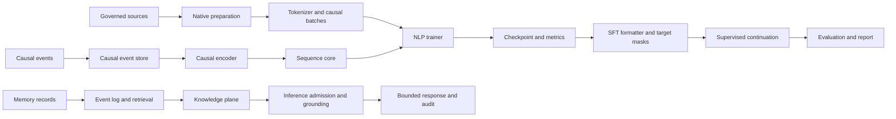

# CCT Architecture

## Review status

This document is the **implementation-grounded architecture** for the Chrono-Causal Tapestry (CCT) repository. It replaces unverified architectural language with contracts that can be traced to native C++20 source, tests, gates, and artifacts.

The review baseline is the current checkout at commit `a888b52ef462ccfca0560b28b8e3bf46741e5eb8`. A clean native Release build with `-Wall -Wextra -Wpedantic -Werror` completed successfully, and the current CTest suite reported **37/37 tests passing**. That result validates the registered tests and gates; it does not, by itself, validate broad language capability, causal understanding, or production readiness.

## 1. Architectural position

CCT is currently a **native numerical and sequence-learning research engine**. Its strongest shipped substrate consists of:

1. typed causal events and DAG validation;
2. finite-difference and spectral field solvers;
3. a selective recurrent sequence core with streaming execution;
4. a native tokenizer, causal batch builder, and next-token trainer;
5. governed corpus preparation and provenance records;
6. persistent event-log memory and retrieval;
7. supervised target-span formatting;
8. bounded retrieval-aware inference and release-control interfaces; and
9. stage-specific tests and formal gates.

The implementation is not currently a full manifold computer, a complete PDE-trained language model, a topological memory engine, or a generative production service. Those are research directions or incomplete contracts and must not be described as shipped behavior.

## 2. End-to-end data and execution flow



The repository contains two partially overlapping execution surfaces. The first is the **research core**: fields, events, recurrence, memory, causal learning, tokenizer, and NLP training. The second is the **operational contract surface**: policy, knowledge retrieval, inference admission, streaming, deployment release, metrics, rollback, and release gates. The operational surface currently validates lifecycle behavior and bounded responses, but it is not yet connected to a trained generative CCT model.

## 3. Repository implementation map

| Subsystem | Primary implementation | Actual responsibility | Current maturity |
|---|---|---|---|
| Field numerical layer | `cpp/include/cct/field.hpp`, `cpp/src/field.cpp` | Grid-shaped scalar field state, finite-difference stepping, spectral Laplacian, operator loss, and selected gradient helpers | Implemented and tested; model integration remains limited |
| Event and causal layer | `cpp/include/cct/event.hpp`, `cpp/src/causal.cpp` | Event validation, parent references, DAG checks, topological ordering, event encoding, synthetic structural data, ridge learner | Implemented and tested; causal claims are bounded by the synthetic learner and explicit graph input |
| Sequence layer | `cpp/include/cct/sequence.hpp`, `cpp/src/sequence.cpp` | Stateful recurrent updates, optional complex rotation, optional state normalization, full/scan execution, and analytic gradient path | Implemented and tested; complex/normalized gradient path needs correction |
| Memory layer | `cpp/include/cct/memory.hpp`, `cpp/src/memory.cpp` | Versioned records, event-log replay, tombstones, quarantine, retrieval, citations, and snapshots | Implemented and tested; retrieval is linear and checksums are not cryptographic authentication |
| Corpus governance | `cpp/include/cct/corpus.hpp`, `cpp/src/corpus.cpp` | Source policy, normalization, heuristic PII/code labels, duplicate checks, split records, sharding, and serialized corpus state | Implemented and tested; heuristics are not sufficient for production privacy or deduplication |
| Tokenizer | `cpp/include/cct/tokenizer.hpp`, `cpp/src/tokenizer.cpp` | Byte/subword tokenization, snapshot identity, Unicode offsets, causal packing, masks, and batch construction | Implemented and tested; Unicode and resource limits need stronger adversarial coverage |
| NLP training | `cpp/include/cct/nlp_trainer.hpp`, `cpp/src/nlp_trainer.cpp` | Native next-token model, CCT recurrence path, baseline paths, optimizer, checkpointing, and metrics | Implemented and tested; Track 1 model path is not identical to the general sequence core |
| SFT/adapters | `cpp/include/cct/sft.hpp`, `cpp/src/sft.cpp`, `cpp/tools/track1_train.cpp` | Canonical supervised formatting, target-span masks, structured-output validation, and Track 1 continuation training | Formatter and Track 1 path implemented; complete adapter lifecycle remains incomplete |
| Track 1 acquisition | `cpp/include/cct/track1.hpp`, `cpp/src/track1.cpp` | Pinned WikiText-2 archive and GEM SQuAD acquisition, parsing, balancing, split isolation, and manifests | Implemented and tested; source-specific parser is still a custom JSON implementation |
| Knowledge and retrieval | `cpp/include/cct/knowledge.hpp`, `cpp/src/knowledge.cpp` | Versioned knowledge records, retrieval, grounding, citation spans, and verification | Implemented and tested; index and embedding behavior are bounded and simple |
| Inference operations | `cpp/include/cct/inference.hpp`, `cpp/src/inference.cpp` | Admission control, policy checks, release routing, state/cache bookkeeping, retrieval grounding, streaming events, SLO accounting | Lifecycle harness implemented; actual model generation and concurrent service execution are absent |
| Release controls | `cpp/include/cct/release.hpp`, `cpp/src/release.cpp` | Release identities, approvals, shadow/pilot records, rollback, deletion, and drift records | Governance contracts implemented; external deployment integration is not present |
| Build and gates | `cpp/CMakeLists.txt`, `Makefile`, `cpp/tools/stage*_gate.cpp` | Native compilation, CTest registration, stage gates, Track 1 gates, and cumulative CI | 37 registered tests pass in the review build; gate quality varies and several are synthetic |

## 4. Core mathematical contracts

### 4.1 Field and spectral layer

The field subsystem stores a real-valued vector over a declared multidimensional shape. A state contains a field value and a velocity-like field. The finite-difference solver computes a wave-style update from a discrete Laplacian, source term, and pointwise potential. The spectral solver computes a periodic Laplacian through FFTW.

The shipped contract is therefore:

\[
\phi_{t+1}=\mathcal{S}(\phi_t,\psi_t,J_t,V_t;\Delta t,\Delta x,c),
\]

where \(\mathcal{S}\) is the implemented numerical stepper. The repository contains stability checks and operator-gradient helpers, but it does not implement the full Lorentzian manifold, learned metric tensor, adaptive mesh, Green’s-function denominator, or variational posterior described in earlier prose.

The spectral implementation requires special care: FFT-based differentiation is periodic by construction, so the boundary condition is a model choice rather than a neutral optimization. The field tests must therefore state the boundary condition, grid shape, spacing, timestep, and expected spectrum for every numerical claim.

### 4.2 Sequence state

The general sequence core maps an input vector \(x_t\) and previous state \(h_t\) to a new state and output:

\[
 h_{t+1}=F_\theta(x_t,h_t,m_t),\qquad y_t=G_\theta(x_t,h_{t+1}),
\]

where \(m_t\) is the causal mask. The implementation uses projected input terms, recurrent terms, sigmoid gates, an optional complex-state rotation, optional state normalization, and an output projection.

The intended invariant is that masked positions do not update state and do not contribute to the loss. This invariant is not currently preserved by the analytic gradient path for all modes: the review probe found maximum finite-difference errors of approximately `0.0011179` in complex masked mode and `0.0810910` in complex-plus-normalized masked mode, while the plain mode error was approximately `5.1e-12`. These modes must not be used for training claims until corrected.

### 4.3 Causal event representation

The causal store uses explicit event IDs, timestamps, parent IDs, coordinates, semantic payloads, uncertainty, provenance, and optional interventions. Parent edges are validated as sorted unique references, unresolved parents are explicit when enabled, and present edges are checked for cycles.

The encoder converts a causal event into a fixed feature vector containing some combination of payload, mean available parent payload, coordinates, scaled timestamp, intervention markers, uncertainty, provenance one-hot values, and edge counts. This is a **feature engineering layer**, not a learned causal manifold. Parent aggregation is a simple mean and does not recover graph structure beyond the supplied edges.

### 4.4 Causal learner

The synthetic causal learner fits linear and fixed nonlinear feature expansions by ridge regression. For each child variable, it builds a design matrix containing an intercept, parent values, and a fixed transformation

\[
1000(\tanh(x)-x).
\]

It chooses the nonlinear fit only when training error is less than 90% of the linear fit error. This is a useful controlled experiment, but it is not a general structural causal discovery algorithm: parent hypotheses are supplied by the caller, the nonlinear basis is fixed, the confidence score is a heuristic signal magnitude, and the regression is solved through normal equations with a small diagonal ridge term.

### 4.5 Memory and retrieval

Persistent memory is an append-oriented event log. Records contain content, embeddings, event references, causal parents, validity intervals, provenance spans, confidence, status, retention, and conflict group. Updates, tombstones, quarantines, capacity expiry, replay, and snapshots are represented as events.

The current encoder produces deterministic hash-derived vectors from the supplied embedding and record metadata. It is not a learned semantic encoder. Retrieval scans active records linearly and ranks by cosine similarity, confidence, version, and ID. Citation binding verifies that the active record version and stored checksum still match the retrieved hit.

### 4.6 Native language training

The Track 1 path uses a native next-token objective with causal masking and checkpointed optimizer state. WikiText-2 provides pretraining text. SQuAD 2.0 provides target-span supervised continuation examples. The current report measures target-token next-token behavior; it does not implement constrained answer decoding, exact match, or F1.

The most important architectural distinction is that the Track 1 `NextTokenModel` contains its own CCT recurrence implementation in `cpp/src/nlp_trainer.cpp`. It is not a direct composition of the general `SelectiveSequenceCore` in `cpp/src/sequence.cpp`. Consequently, a Track 1 result is evidence for the NLP trainer’s CCT path, not automatically evidence for every feature of the general sequence core.

## 5. Actual system boundaries

### 5.1 What is connected

The following path is connected and exercised:

```text
pinned source
  -> native Track 1 preparation
  -> tokenizer and causal documents
  -> native next-token trainer
  -> checkpoint and metrics report
  -> SFT target-span masks
  -> frozen target-token evaluation
```

The causal encoder can feed the general sequence core, and the memory layer can produce retrieval hits and citation bindings. The inference layer can consume retrieval hits and return grounded content with audit events.

### 5.2 What is not connected

The following connections are not yet real end-to-end model behavior:

1. `InferenceService` does not invoke a trained CCT generative model. Without retrieval it returns a route-labelled echo such as `CCT-ASE response: <input>`.
2. The `transformer` and `hybrid` model routes are labels and response prefixes, not separate model backends.
3. Streaming splits a completed response into whitespace words after `handle()` has already executed and updated state; it is not incremental model decoding.
4. The Track 1 trainer does not use the general complex or normalized sequence-core modes.
5. Memory retrieval uses a deterministic hash encoder and linear scan rather than a learned embedding model and indexed search.
6. The mathematical manifold, topological memory, eigenmode reasoning, learned metric, variational inference, and claimed scaling laws are not implemented as end-to-end components.

## 6. Complexity and resource reality

| Operation | Documented aspiration | Current implementation | Review conclusion |
|---|---|---|---|
| General sequence update | Spectral `O(n log n)` | Recurrent dense projections; approximately `O(T * H * D)` per sequence | Do not claim `O(n log n)` for the shipped sequence path |
| Dense baseline | Reference attention | Recomputes key/value projections for every prior position and allocates vectors inside each step | Correctness comparator, but unsuitable as a performance baseline without allocation accounting |
| Causal graph lookup | Indexed logarithmic lookup | Linear scan through `ordered_events_` | Current lookup is `O(E)` |
| Memory retrieval | Tree/index retrieval | Linear scan of active records | Current retrieval is `O(M)` |
| Duplicate detection | Scalable contamination control | Exact hash plus pairwise set-Jaccard scan | Worst-case quadratic in accepted records |
| Causal ridge fit | Stable learner | Normal equations and dense Gauss-Jordan elimination | Can be ill-conditioned and scales poorly |
| FFT field step | `O(n log n)` transform | FFTW path for supported periodic field layout | Plausible for that kernel only; not a whole-model guarantee |
| Inference queue | Batching and SLO control | In-process vector queue with synchronous `handle()` processing | No concurrent scheduler or real queue-delay measurement |
| Streaming | Token streaming | Full response first, then word splitting | Latency and cancellation claims are invalid for true streaming |

## 7. Strong engineering areas

The repository has several strong foundations. It uses native C++20 consistently across the core, documents explicit schemas and identity fields, has strict-warning Release compilation, and registers a broad test and gate surface. It has unusually good attention to deterministic manifests, split isolation, Unicode answer offsets, checkpoint identity, malformed-input rejection, memory replay, and bounded policy decisions for a research repository.

The causal and memory APIs are typed rather than unstructured maps. The event store rejects duplicate IDs, validates dimensions, checks explicit unresolved parents, and rejects cycles. The memory layer supports append/update/tombstone/quarantine records and replays its event log. Track 1 uses direct pinned files after the rows API rate-limit issue was discovered, and the full native suite can be built and run reproducibly when the toolchain is available.

These are **engineering strengths**, not proof that the mathematical hypotheses or language capabilities are correct. The strongest next step is to make the documented architecture match the shipped implementation, then add independent behavioral evidence for each claimed advantage.

## 8. Architectural priorities

The first priority is correctness of the trainable path: unify or explicitly distinguish the NLP recurrence from the general sequence core, correct complex/normalized gradient handling, and add finite-difference or autodiff-equivalent tests for every trainable mode.

The second priority is honest system integration: replace template inference outputs with a real checkpoint-backed model interface, implement true incremental decoding, make routing select actual backends, and measure concurrent queue behavior rather than only stateful synchronous calls.

The third priority is mathematical validation: formulate the actual discrete operator, state the boundary conditions and timestep domain, prove or test stability in that domain, compare against matched baselines, and remove unsupported complexity, geometry, topology, and scaling claims until their implementations and measurements exist.

The fourth priority is data and persistence hardening: replace heuristic privacy checks and custom parsers with bounded, standards-compliant validation, strengthen checksums and atomic persistence, and add indexed retrieval and scalable deduplication.

## 9. Verification commands

The following commands reproduce the baseline review build and registered test suite:

```bash
cmake -S cpp -B build-review \
  -DCMAKE_BUILD_TYPE=Release \
  -DCMAKE_CXX_FLAGS='-Wall -Wextra -Wpedantic -Werror'
cmake --build build-review --parallel 2
ctest --test-dir build-review --output-on-failure
```

The review build completed with **37/37 tests passing**. A sanitizer build reached the test phase after demoting a GCC sanitizer-build `array-bounds` warning, but the full sanitizer run exceeded the review timeout during the slower stage tests and was stopped. This is recorded as a validation limitation, not a sanitizer pass.

## References

- [CCT Level 1 goal](SPEC/Goal.md)
- [CCT Level 1 todo](SPEC/Todo.md)
- [Native CMake contract](cpp/CMakeLists.txt)
- [Canonical Makefile](Makefile)
- [Sequence interface](cpp/include/cct/sequence.hpp)
- [Sequence implementation](cpp/src/sequence.cpp)
- [Field implementation](cpp/src/field.cpp)
- [Causal implementation](cpp/src/causal.cpp)
- [Memory implementation](cpp/src/memory.cpp)
- [Corpus implementation](cpp/src/corpus.cpp)
- [Tokenizer implementation](cpp/src/tokenizer.cpp)
- [NLP trainer implementation](cpp/src/nlp_trainer.cpp)
- [Track 1 trainer](cpp/tools/track1_train.cpp)
- [SFT implementation](cpp/src/sft.cpp)
- [Inference implementation](cpp/src/inference.cpp)
